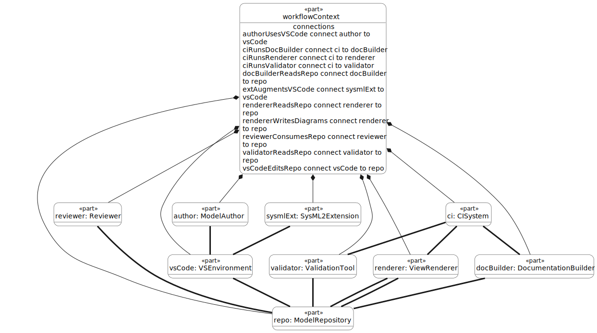
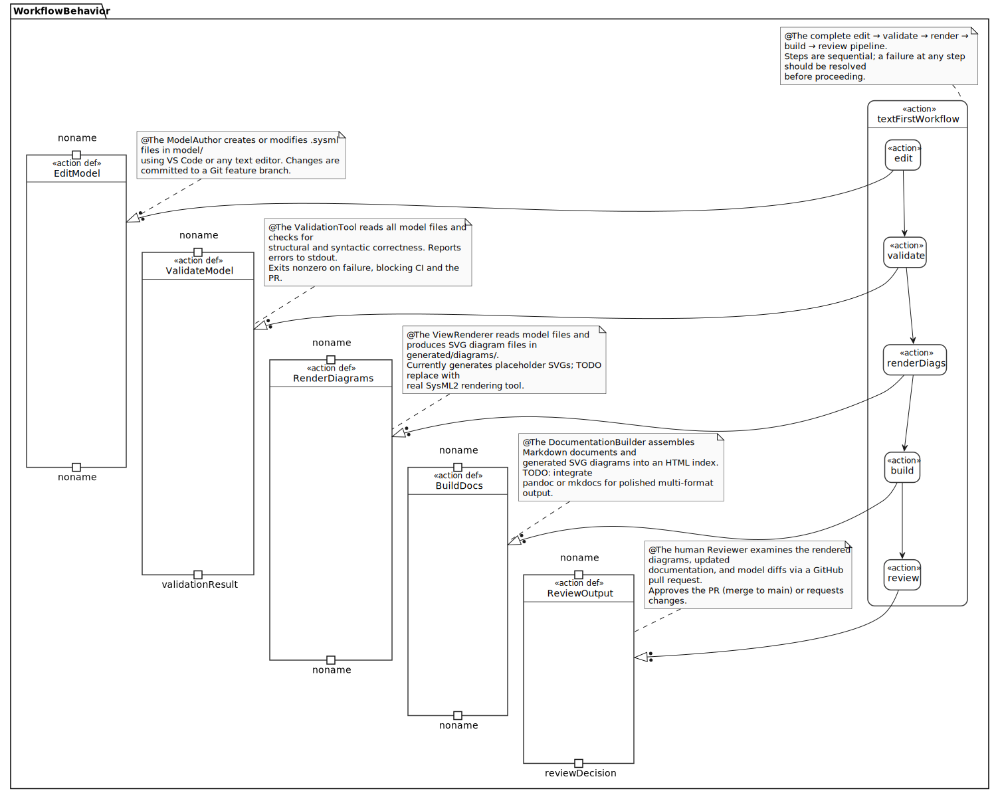

# SysML2 Workflow — Edit → Validate → Render → Build

This document describes the end-to-end workflow for authoring, validating, rendering, and publishing SysML2 model artifacts in this repository.

---

## Workflow Overview

```
 ┌──────────┐    ┌──────────────┐    ┌────────────────┐    ┌────────────┐
 │  Edit    │───►│  Validate    │───►│  Render        │───►│  Build     │
 │ .sysml   │    │  model files │    │  diagrams      │    │  docs      │
 └──────────┘    └──────────────┘    └────────────────┘    └────────────┘
     │                  │                    │                    │
  VS Code           scripts/            scripts/            scripts/
  or editor     validate-model      render-diagrams        build-docs
```

Each step is implemented as a standalone shell script in `scripts/` and as a VS Code task in `.vscode/tasks.json`. The same scripts are invoked by GitHub Actions on every push and pull request.

---

## Step 1: Edit

**Tool:** VS Code (recommended) or any text editor
**Files:** `model/template/*.sysml`

Model artifacts are plain-text SysML2 files. There is no GUI modeling tool required. Authors edit files directly and commit changes to a Git branch.

The recommended VS Code extensions (`.vscode/extensions.json`) provide:
- Syntax highlighting for `.sysml` files (when a SysML2 extension is available)
- Markdown preview for documentation files
- GitLens for change tracking

---

## Step 2: Validate

**Script:** `scripts/validate-model`
**VS Code Task:** Validate Model

The validate script loads all model files into the OMG SysML v2 Pilot Implementation interactive kernel (`SysMLInteractive`) in dependency order, checking that every file parses without errors.

A non-zero exit code from the validate script causes the GitHub Actions `validate.yml` workflow to fail, blocking the PR.

---

## Step 3: Render

**Script:** `scripts/render-diagrams`
**VS Code Task:** Render Diagrams
**Output:** `generated/diagrams/*.svg`

The render script loads the model into `SysMLInteractive`, issues `%viz` commands for each diagram element, and pipes the PlantUML output through `tools/SysMLRender.java`, which renders each block to SVG using the PlantUML library bundled in the OMG JAR.

Generated SVGs are committed to the repository in `generated/diagrams/` so that documentation is always renderable without running the script locally.




---

## Step 4: Build Docs

**Script:** `scripts/build-docs`
**VS Code Task:** Build Docs
**Output:** `generated/docs/index.html`

The build-docs script builds a navigable HTML documentation site from the Markdown sources using
[Sphinx](https://www.sphinx-doc.org/) with the [MyST parser](https://myst-parser.readthedocs.io/)
and the `sphinx_rtd_theme`. The generated site includes a table of contents, search, and the SVG
diagrams embedded in `workflow.md` via standard Markdown image links.

Dependencies are declared in `docs/requirements.txt` and installed by `scripts/setup-tools`.

The repository also includes a `.readthedocs.yaml` configuration file. Connecting the repository
to [Read the Docs](https://readthedocs.io/) will build and host the documentation automatically on
every push, with versioned builds per branch and tag.

---

## How Model Files, Diagrams, and Docs Relate

```
model/
  template/requirements.sysml  ────────────────────────► (referenced in docs)
  template/context.sysml       ────────────────────────► generated/diagrams/context.svg
  template/workflow.sysml      ────────────────────────► generated/diagrams/artifact-flow.svg

generated/diagrams/
  context.svg         ──► embedded in docs/workflow.md
  artifact-flow.svg   ──► embedded in docs/workflow.md

docs/
  overview.md         ──► rendered in GitHub / VS Code preview / Sphinx HTML
  workflow.md         ──► rendered in GitHub / VS Code preview / Sphinx HTML
```

---

## GitHub PR Review as V&V

The GitHub pull request process serves as the formal Verification & Validation gate:

1. **AI agent** (or any author) creates a feature branch and drafts model artifacts
2. **Author** opens a Pull Request targeting `main`
3. **GitHub Actions** automatically runs `validate-model`, `render-diagrams`, and `build-docs`
   - If any script fails (non-zero exit), the PR is blocked
4. **Human Reviewer (V&V role)** reviews:
   - The `.sysml` model diffs for correctness and completeness
   - The rendered SVG diagrams (visible in the PR diff and in `generated/diagrams/`)
   - The updated documentation in `docs/`
5. **Reviewer approves** the PR, triggering merge to `main`

This process ensures that no model change reaches `main` without human review of both the text artifact and the rendered output.

---

## Running the Full Pipeline

```bash
# From the repository root:
scripts/validate-model   # Step 2: Validate
scripts/render-diagrams  # Step 3: Render
scripts/build-docs       # Step 4: Build

# Or use the VS Code "Build All" task which runs them in sequence.
```
